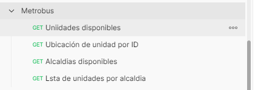
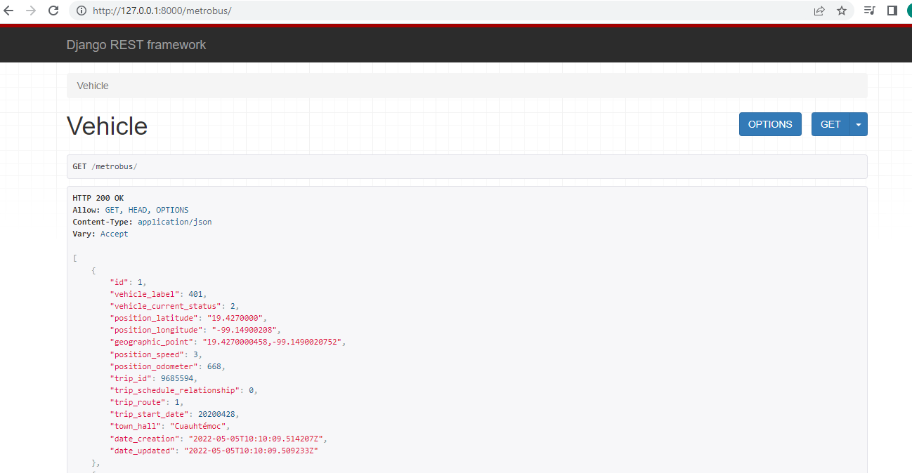
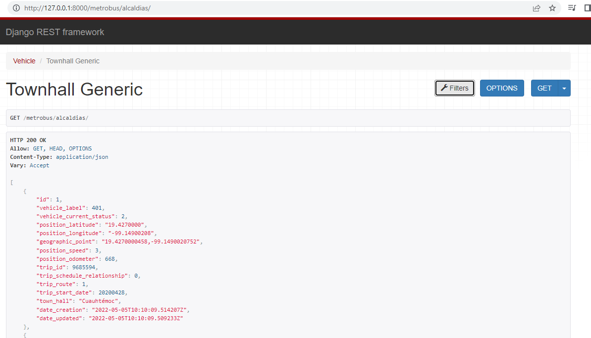
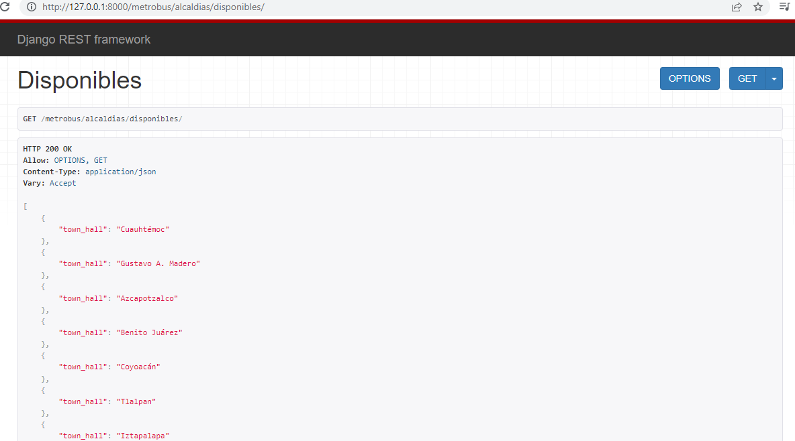

# Metrobus CD MX

API de Metrobus donde muestra las unidades disponibles y a que alcaldias pertenece 


## Instalación
### Instalar Python 3:
- Checar la liga de descarga https://www.python.org/downloads/

#### Crear entorno virtual:
- Ir al directorio de tu proyecto, usar la consola y correr el siguiente comando 
```shell
> python3 -m venv env
``` 
- Para activar entorno virtual
```shell
> source env/bin/activate
```

#### Instalar requerimientos:
```shell
> pip install -r requirements.txt
```

## Correr API Server
```shell
> python manage.py runserver
```
## Lista de Request de Postman


- [Metrobus Colección de la Api](https://github.com/ubaldoesp/Metrobus/tree/main/postman)


## Ejemplo de la Api corriendo

- List | Metrobuses



- Get | Metrobus por ID


- Get | Unidades por Alcaldia 




- List | Alcaldias disponibles 




- http://127.0.0.1:8000/metrobus/
- http://127.0.0.1:8000/metrobus/id
- http://127.0.0.1:8000/metrobus/alcaldias
- http://127.0.0.1:8000/metrobus/alcaldias/?town_hall=Cuauhtémoc
- http://127.0.0.1:8000/metrobus/alcaldias/disponibles/
